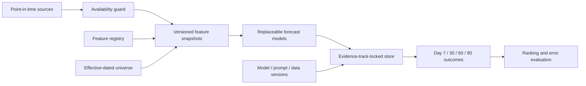

# AI Market Universe

A minimal, falsifiable research harness for testing whether point-in-time public information contains out-of-sample signal about 90-day benchmark-adjusted equity returns.

This is research infrastructure, not a trading system. V0 deliberately excludes brokerage integration, execution, a production UI, and claims based on synthetic data.

[](https://github.com/stephiesworld/ai-market-universe/actions/workflows/ci.yml)

## Architecture



The information clock is the central constraint: a value is eligible only if a real observer could have known it at the frozen prediction timestamp.

## What is implemented

- Explicit publication, effective, availability, and ingestion clocks.
- Explicit missingness: unavailable values are `null` with `available=false`; numeric zero remains a valid observed value.
- A reproducible five-stock smoke universe.
- Effective-dated universe membership to expose survivorship assumptions.
- Price-based point-in-time feature snapshots.
- A feature registry with economic rationale and provenance fields.
- Calendar-day forward labels with trading-calendar endpoint handling.
- Zero-excess, momentum, and transparent ridge baselines.
- Temporal train/validation/test splits with no random shuffle.
- MAE, directional hit rate, Spearman rank IC, and top-minus-bottom evaluation.
- PEAD event feature helpers, including surprise/reaction interactions.
- Immutable SQLite forecasts protected by update/delete triggers and payload hashes.
- Full feature-level provenance embedded in every stored forecast object.
- Evidence-track-locked stores that prevent prospective, historical, and synthetic records from being mixed.
- A deterministic synthetic demo and standard-library test suite.

## Quick start

Use Python 3.11 or newer. From this directory:

```bash
python -m venv .venv
source .venv/bin/activate
python -m pip install -e .
python -m unittest discover -s tests -v
market-universe demo --output-dir artifacts/demo
```

The demo creates a research frame, model predictions, metrics, an append-only forecast database, and a hash manifest. They verify the pipeline only. The fixture generator is intentionally labeled synthetic; its metrics are not investment evidence.

See the [synthetic example output](docs/example-output.md) for a compact walkthrough of the generated artifacts and their interpretation.

## Information clock

Every non-price source record must retain:

- `as_of`: the exact timestamp at which the system asked what was knowable.
- `published_at`: when the source published the value.
- `effective_at`: the business period/date the value describes.
- `available_at`: when the value could first have entered a forecast.
- `ingested_at`: when this system captured it.
- `source` and `source_record_id`: provenance and deduplication keys.
- `point_in_time_verified`: whether the availability claim has been checked.

At a prediction timestamp `T`, the harness selects only records whose `available_at <= T`. It does not forward-fill across disclosure boundaries.

Missing is never neutral. If consensus was not reliably available at `T`, the serialized feature is equivalent to:

```json
{
  "value": null,
  "available": false,
  "missing_reason": "no point-in-time consensus vendor record",
  "provenance": {
    "as_of": "2026-08-24T14:00:00-04:00",
    "published_at": null,
    "source": null,
    "point_in_time_verified": true
  }
}
```

It must not be encoded as `0`, imputed before the temporal split, or treated as a neutral analyst estimate.
Registered features are materialized even when absent, so `consensus_eps` cannot silently disappear from a snapshot. The fixture demo therefore stores unavailable consensus and valuation fields explicitly rather than omitting them.

## Evidence tracks

The project has three physically labeled tracks:

- `prospective_live_paper`: frozen weekly forecasts scored only after outcomes mature. This is the cleanest evidence.
- `historical_backtest`: PEAD and feature-interaction research using reconstructed point-in-time datasets.
- `synthetic_fixture`: engineering checks only; never evidence about markets.

Each forecast database is locked to one track in `store_metadata`. An attempt to open or write it as another track fails. Historical model selection and backtest results may inform a future version, but they never retroactively alter a prospective forecast.

## Data adapter contract

`CsvPointInTimeProvider` is the first vendor-neutral adapter. Input data is long-form and must include:

```text
ticker,field,value,published_at,effective_at,available_at,ingested_at,source,source_record_id
```

Do not connect a fundamentals or consensus source unless it supplies historical vintages or enough raw timestamps to reconstruct them. Today's revised history is not acceptable for a backtest.

## V0 workflow

1. Load a universe whose membership is valid at the cohort timestamp.
2. Resolve all source records as of the frozen timestamp.
3. Build a versioned feature snapshot per stock.
4. Produce forecasts through a replaceable model interface.
5. Append forecasts to immutable storage before outcomes exist.
6. Collect Day 7/30/60/90 prices and event metadata later.
7. Evaluate the same cohorts and horizons for every baseline/model version.
8. Report aggregate and cohort-level results; stocks inside a cohort are correlated observations.

## Scope decision: five-stock cohort and PEAD

The formal build spec prioritizes a five-stock end-to-end cohort, while the prior conversation prioritizes a PEAD vertical slice. This project treats them as two observation types sharing the same infrastructure:

- Weekly cohort rows predict 90-day relative returns.
- Earnings-event rows begin after the announcement/reaction information is available and predict 5/20/60/90-day post-event relative returns.

This avoids building two incompatible pipelines and keeps the PEAD experiment ready for a trustworthy point-in-time earnings/consensus vendor.

## Before any real empirical claim

The next decision is a historical point-in-time data provider. Price history alone can exercise the harness, but it cannot test the locked expectations-gap thesis. At minimum, a real PEAD study needs timestamped earnings actuals, historical consensus vintages, announcement timing, splits/dividends, volume, delisted securities or an explicit survivorship limitation, sector classifications effective at the time, and benchmark prices.

## Disclaimer

This repository is for software engineering and financial research. It does not provide investment advice, trading recommendations, or a representation that any model or strategy will be profitable. Synthetic fixtures and backtests are not prospective market evidence. Any real-world use requires independent validation of data rights, timestamp integrity, transaction costs, liquidity, taxes, risk, and applicable law.

## License

MIT. See [LICENSE](LICENSE).
